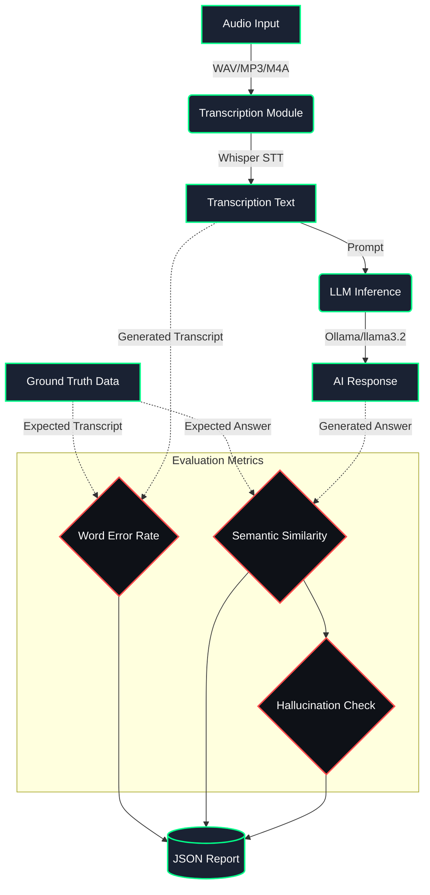
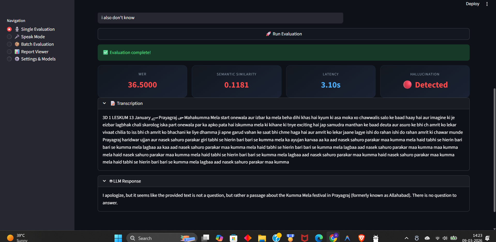
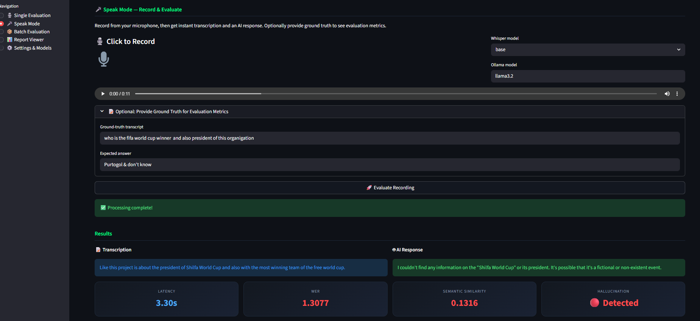

# Voice AI Evaluation Pipeline

A production-ready evaluation framework for Voice AI systems. This project provides an automated pipeline to evaluate Speech-to-Text (STT) and Large Language Model (LLM) performance using deterministic scoring, robust metrics, and an interactive Streamlit dashboard.

---

## 🎯 Project Objectives & Requirements Achieved

This project was built to fulfill the following core requirements:
- **Python-based framework**: Modular, well-tested Python backend (`FastAPI`).
- **Open-source LLM Integration**: Uses `LangChain` to communicate with local `Ollama` models (e.g., `llama3.2`).
- **Deterministic Scoring**: Forces `temperature=0` across both Whisper and the LLM, alongside fixed seeds to guarantee reproducible results.
- **Audio Transcription**: Uses `OpenAI Whisper` with a robust `imageio-ffmpeg` fallback to ensure cross-platform compatibility without relying on system-level DLLs.
- **Metrics**: Calculates Word Error Rate (WER), Semantic Similarity (using embeddings), LLM Latency, and Hallucination Rates.
- **JSON Reports**: All batch evaluations are saved structurally in the `reports/` directory.

---

## ✨ Features

- **Single Audio Evaluation**: Upload an audio file (.wav, .mp3, .m4a), provide the ground truth, and instantly see transcription and LLM responses.
- **🎤 Speak Mode (Live Mic)**: Record audio directly in the browser. Evaluate it instantly with optional ground-truth logging.
- **Auto-Dataset Building**: Whenever you evaluate a single file or use Speak Mode with ground truth provided, the audio and expected answers are automatically saved to `dataset/audio/` and appended to `dataset/ground_truth.json`.
- **Batch Evaluation**: Run the pipeline over your entire dataset directory in one click, generating aggregate statistics and comprehensive JSON reports.
- **Report Viewer**: Browse past evaluation reports visually via the Streamlit dashboard.

---

## ⚙️ Architecture & Tech Stack



| Component | Technology | Description |
|-----------|-----------|-------------|
| **Backend API** | FastAPI + Uvicorn | Exposes REST endpoints for pipeline tasks. |
| **Frontend UI** | Streamlit + Plotly | Reactive dashboard for metrics and interaction. |
| **Speech-to-Text** | OpenAI Whisper | Local, offline transcription. |
| **LLM Inference** | LangChain + Ollama | Local inference for data privacy and zero cost. |
| **Word Error Rate** | `jiwer` | Industry-standard STT metric. |
| **Semantic Sim** | `sentence-transformers` | `all-MiniLM-L6-v2` embeddings for deep contextual matching. |

---

## 🚀 Quick Start Guide

### 1. Prerequisites
You need **Python 3.11+** and **Ollama** installed on your system.

### 2. Environment Setup
```bash
# Create and activate a conda environment
conda create -n voiceai python=3.11 -y
conda activate voiceai

# Install Python dependencies
pip install -r requirements.txt
```

### 3. Start the LLM (Ollama)
Ensure the Ollama service is running in the background and that you have pulled the required model (`llama3.2` is the default):
```bash
ollama serve
# In a new terminal:
ollama pull llama3.2
```

### 4. Run the Application
You need two terminal windows running in the `voice_ai_evaluation` directory:

**Terminal 1: Start the Backend (FastAPI)**
```bash
conda activate voiceai
uvicorn main:app --reload --port 8000
```

**Terminal 2: Start the Frontend (Streamlit)**
```bash
conda activate voiceai
streamlit run app.py
```

*The UI will automatically open in your browser at `http://localhost:8501`.*

---

## 📁 Project Structure

```text
voice_ai_evaluation/
├── src/
│   ├── transcription.py     # Whisper STT & robust ffmpeg audio decoding
│   ├── llm_inference.py     # LangChain + Ollama integration
│   ├── metrics.py           # WER, similarity, latency, hallucination
│   └── evaluator.py         # Pipeline orchestrator
├── tests/
│   ├── test_metrics.py      # Unit tests for scoring logic
│   └── test_pipeline.py     # Integration tests (mocked endpoints)
├── dataset/
│   ├── audio/               # Auto-saved and batch audio files
│   └── ground_truth.json    # Reference transcripts and expected answers
├── reports/                 # JSON evaluation reports generated by batch runs
├── main.py                  # FastAPI backend application
├── app.py                   # Streamlit frontend dashboard
├── requirements.txt         # Project dependencies
└── README.md                # This documentation
```

---

## 📷 Screenshots

### 1. Front UI of the Streamlit Page
*(Save your image as `images/front_ui.png`)*


### 2. Single Evaluation
*(Save your image as `images/single_evaluation.png`)*


### 3. Speak Mode
*(Save your image as `images/speak_mode.png`)*


### 4. Batch Evaluation (Summary)
*(Save your image as `images/batch_evaluation_summary.png`)*


### 5. Batch Evaluation (Charts)
*(Save your image as `images/batch_evaluation_charts.png`)*


---

## 📊 Evaluation Metrics Explained

1. **Word Error Rate (WER)**: 
   - *What it is*: Measures the exact word-for-word difference between the ground-truth transcript and Whisper's output (insertions, deletions, substitutions).
   - *Scale*: 0.0 is perfect. Closer to 0 is better.
2. **Semantic Similarity**: 
   - *What it is*: Compares the *meaning* of the expected answer against the LLM's generated response using vector embeddings.
   - *Scale*: 0.0 to 1.0 (1.0 means exact semantic match).
3. **Hallucination Detection**:
   - *What it is*: A boolean flag. If the semantic similarity drops below an acceptable threshold (default `0.4`), the pipeline flags the LLM response as a potential hallucination.
4. **Latency**:
   - *What it is*: Wall-clock time taken strictly for the LLM inference step.

---

## 🧪 Running Tests

The project includes both unit tests for the metric functions and mocked integration tests for the evaluation pipeline. To ensure everything is working correctly:

```bash
pytest tests/ -v
```

### Passing Test Output
```text
=============================== test session starts ===============================
platform win32 -- Python 3.11.14, pytest-9.0.2, pluggy-1.6.0
collected 24 items                                                                                           

tests/test_metrics.py::TestComputeWer::test_perfect_match PASSED                                       [  4%] 
tests/test_metrics.py::TestComputeWer::test_case_insensitive PASSED                                    [  8%] 
tests/test_metrics.py::TestComputeWer::test_complete_mismatch PASSED                                   [ 12%] 
tests/test_metrics.py::TestComputeWer::test_partial_mismatch PASSED                                    [ 16%]
tests/test_metrics.py::TestComputeWer::test_empty_hypothesis PASSED                                    [ 20%] 
tests/test_metrics.py::TestSemanticSimilarity::test_identical_texts PASSED                             [ 25%]
tests/test_metrics.py::TestSemanticSimilarity::test_related_texts PASSED                               [ 29%] 
tests/test_metrics.py::TestSemanticSimilarity::test_unrelated_texts PASSED                             [ 33%]
tests/test_metrics.py::TestSemanticSimilarity::test_range PASSED                                       [ 37%]
tests/test_metrics.py::TestDetectHallucination::test_below_threshold PASSED                            [ 41%] 
tests/test_metrics.py::TestDetectHallucination::test_above_threshold PASSED                            [ 45%] 
tests/test_metrics.py::TestDetectHallucination::test_at_boundary PASSED                                [ 50%] 
tests/test_metrics.py::TestDetectHallucination::test_custom_threshold PASSED                           [ 54%] 
tests/test_metrics.py::TestMeasureLatency::test_returns_correct_result PASSED                          [ 58%] 
tests/test_metrics.py::TestMeasureLatency::test_non_negative_time PASSED                               [ 62%] 
tests/test_metrics.py::TestMeasureLatency::test_with_kwargs PASSED                                     [ 66%] 
tests/test_pipeline.py::TestEvaluateSample::test_returns_all_required_keys PASSED                      [ 70%]
tests/test_pipeline.py::TestEvaluateSample::test_wer_zero_when_transcript_matches PASSED               [ 75%]
tests/test_pipeline.py::TestEvaluateSample::test_no_hallucination_when_response_matches PASSED         [ 79%]
tests/test_pipeline.py::TestEvaluateSample::test_latency_non_negative PASSED                           [ 83%]
tests/test_pipeline.py::TestEvaluateBatch::test_skips_missing_audio PASSED                             [ 87%]
tests/test_pipeline.py::TestEvaluateBatch::test_includes_summary PASSED                                [ 91%]
tests/test_pipeline.py::TestEvaluateBatch::test_summary_has_required_keys PASSED                       [ 95%]
tests/test_pipeline.py::TestEvaluateBatch::test_batch_processes_existing_files PASSED                  [100%]

====================================== 24 passed, 1 warning in 10.30s =======================================
```
"# Voice-Ai-Evaluation" 
